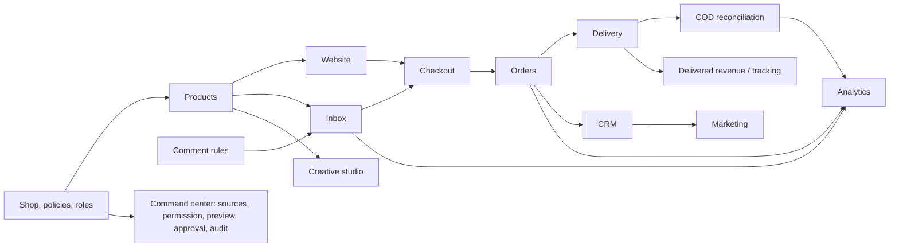

# Product map and frontend contract

Reviewed all 17 PDFs (16 unique documents), master first, then 01–15. The two 05 PDFs have identical SHA-256 hashes. Source extracts are retained for traceability.

## Scope decisions
This section records the original foundation phase. For currently authorized implementation and integration boundaries, see [combined-phase.md](combined-phase.md); the PRD priority/dependency map below remains applicable.

This phase implements only the shell, tokens, primitives, and placeholder routes. No authentication, API calls, persistence, live AI, publishing, payments, or integrations. “Workspace” is a temporary neutral identity. All interactive demonstrations are labeled.

## Priority and route map
| PDF | Priority as specified | Surface |
|---|---|---|
| 00-Platform-Overview-Roadmap | Read first. All other PDFs follow this direction. | Global shell |
| 01-Onboarding-Store-Setup | P0 - first user journey. | Future onboarding |
| 02-Website-Builder-Themes-Storefront | P0 - trust and checkout surface. | /website |
| 03-Products-Inventory-Management | P0 - AI depends on it. | /products |
| 04-AI-Inbox-Messenger-Instagram | P0 - hero feature. | /inbox |
| 05-Comment-Automation-Lead-Capture | P1 - high attraction feature. | /marketing |
| 06-AI-Order-Confirmation-Checkout-Forms | P0 - order quality. | /orders + future buyer checkout |
| 07-Orders-Management-Dashboard | P0 - daily operations. | /orders |
| 08-Delivery-Courier-Integration | P0/P1 depending on available courier APIs. | /delivery |
| 09-Payments-COD-Reconciliation | P1 - after core order/courier flow. | /payments |
| 10-Customers-CRM-Retention | P1 - growth feature. | /customers + /marketing |
| 11-Ads-Tracking-Meta-CAPI | P1/P2 - after orders are reliable. | /ads |
| 12-AI-Ad-Creative-Studio | P1 - can launch before full ads manager. | /ai creative area |
| 13-AI-Command-Center | P1 - after core data/actions exist. | Global command + /ai |
| 14-Analytics-Dashboard | P1 - after reliable event data. | /analytics + /dashboard |
| 15-Team-Settings-Billing-Security | P0/P1 - basic version required before launch. | /settings |

## Dependencies

## Conflicts and open boundaries
- Master navigation omits Customers and Analytics; explicit current request includes both, so both are present.
- Delivery is P0/P1 conditional on courier availability; Settings P0/P1; Ads P1/P2. No invented priority split. No exclusively P2 module is specified.
- PDF 12 creative studio and PDF 13 command center each request a dedicated AI surface; current route list offers /ai only. This shell acknowledges both, but final information architecture needs agreement before implementation.
- No numeric breakpoints specified in PDFs. Foundation uses mobile <768px, compact tablet 768–1199px, expanded desktop ≥1200px, following the current brief.

## Shared patterns
Page header/action slots; filter bars and searchable lists; selectable tables with mobile cards; detail drawers preserving scroll; timelines and audit records; status badges with text/icon; validation summaries and field errors; stepper/preview layouts; confirmation with before/after and affected count; source/last-sync indicators; empty states with one next action; recoverable errors preserving draft; skeletons; toast feedback; permission-disabled actions with explanation.

## Specialized future components
Conversation list/thread/composer; AI reply confidence and source panel; human handoff; extracted order field confidence; product variant matrix; stock ledger; import mapping and row-error report; buyer checkout/risk card; order timeline and bulk preview; courier booking and sync conflict; payment-proof review and settlement matching; consent/audience/campaign preview; theme picker and separate storefront theme tokens; creative variation cards; tracking health and attribution; accessible metric charts; role matrix and usage meter. These are contracts, not implemented modules.

## Responsive and language contract
Inbox three panes collapse to list/detail/context views; tables become operational cards; forms stack without losing errors; builder supports mobile/desktop preview; buyer checkout is mobile-first; long Bangla/Urdu names wrap, and user text uses direction auto. Test low-end Android/4G, touch targets, keyboard, zoom, reduced motion. Storefront themes must remain isolated from internal SaaS tokens.

## AI state contract
Disconnected, suggest-only (default), drafting, source-backed suggestion, missing data, low confidence, stale source, needs human, paused (manual resume), awaiting approval, executing, succeeded, failed/retry, denied permission, undo available/unavailable. Actions progress suggest → draft → approval → execute. Never synthesize price, stock, fee, date, policy, financial outcome, or unsupported certainty. High-risk work always needs explicit human approval. No live AI is included.

## Per-module frontend acceptance and exclusions

### 00-Platform-Overview-Roadmap

**Data Fields**
- Shop: name, subdomain, owner, country, currency, language, timezone.
- Connections: Facebook page, Instagram account, WhatsApp number, courier accounts.
- Commercials: plan, monthly fee, order limit, AI message limit, staff seats.
- Compliance: privacy policy, return policy, COD rules, message consent logs.

**Acceptance Checklist**
- Can a seller launch basic shop in under 5 minutes?
- Can a customer go from message to confirmed order without staff typing details twice?
- Can owner see money, orders, chats, courier issues on one screen?
- Can staff undo or review AI work?

**Do Not Build Yet**
- Do not build full Shopify app store in V1.
- Do not build full Meta Ads Manager clone in V1.
- Do not build custom courier fleet.

### 01-Onboarding-Store-Setup

**Data Fields**
- Owner: name, email, phone, password/OTP, language.
- Shop: legal name, display name, subdomain, category, address, country, currency.
- Policy defaults: delivery charge, return days, COD allowed, advance payment rules.
- First product: name, price, stock, image, variants, delivery notes.

**Acceptance Checklist**
- Signup to live store under 5 minutes for manual path.
- Seller can skip Meta connection and still launch website.
- Import errors show row number and fix instruction.
- No hidden required fields after final launch click.

**Do Not Build Yet**
- No multi-warehouse setup in onboarding.
- No complex tax setup for V1.
- No theme editor during onboarding; choose template only.

### 02-Website-Builder-Themes-Storefront

**Data Fields**
- Theme: id, colors, font set, homepage sections, banner images.
- Storefront: title, meta description, logo, favicon, policy links.
- Checkout: required fields, delivery zones, payment methods, COD rules.
- SEO/share: product slug, social image, product description, schema basics.

**Acceptance Checklist**
- Store opens fast on low-end Android and 4G.
- Buyer can place order in under 60 seconds.
- Every product page has Messenger/WhatsApp fallback.
- No broken layout with long Bangla or Urdu product names.

**Do Not Build Yet**
- No drag-and-drop page builder in V1.
- No custom code injection for normal sellers.
- No 30 themes; start with 5 excellent themes.

### 03-Products-Inventory-Management

**Data Fields**
- Product: name, SKU, category, description, price, compare price, cost optional.
- Inventory: stock, reserved, low stock threshold, warehouse optional V2.
- Variants: size, color, material, image, price override, stock.
- AI facts: selling points, who it is for, care instructions, policy exceptions.

**Acceptance Checklist**
- Stock never goes below zero unless seller enables backorder.
- Bulk import gives clear row-level errors.
- Order creation reserves stock; cancellation releases stock.
- Inventory ledger shows who changed what and when.

**Do Not Build Yet**
- No complex manufacturing/BOM inventory.
- No multi-warehouse in V1 unless one seller truly needs it.
- No barcode system until offline warehouse flow exists.

### 04-AI-Inbox-Messenger-Instagram

**Data Fields**
- Conversation: channel, page, buyer ID, language, intent, status, assigned staff.
- Message: sender, text, attachments, timestamp, AI confidence, source references.
- Customer: name, phone, address, tags, order count, return history.
- Order draft: items, variant, quantity, delivery area, payment method, notes.

**Acceptance Checklist**
- AI must not confirm unavailable stock.
- AI must not promise exact delivery date unless courier status confirms it.
- Staff can see why AI answered that way.
- Every auto-sent message can be found in audit log.

**Do Not Build Yet**
- No voice-call AI in V1.
- No fully autonomous refund/cancel actions.
- No replying from personal staff Facebook accounts.

### 05-Comment-Automation-Lead-Capture

**Data Fields**
- Post: platform, post ID, media, caption, linked product, status.
- Rule: keywords, language, delay, public reply, DM template, limit per hour.
- Lead: commenter ID, name, intent, product interest, DM status, order status.
- Moderation: sentiment, hidden flag, staff action, reason.

**Acceptance Checklist**
- Must respect Meta messaging policies.
- Rate-limit replies to avoid page restriction.
- Seller can preview exactly what buyer receives.
- Negative comments never get cheerful sales DM automatically.

**Do Not Build Yet**
- No mass scraping competitors' comments.
- No fake engagement tools.
- No auto-deleting all negative comments.

### 06-AI-Order-Confirmation-Checkout-Forms

**Data Fields**
- Buyer: name, phone, alternate phone, address, city/district/area.
- Order: item, variant, quantity, price snapshot, discount, delivery charge, total.
- Payment: COD, advance, paid amount, transaction ID, proof image.
- Risk: score, reason, previous returns, duplicate order check.

**Acceptance Checklist**
- No order confirm without phone, address, item, quantity, and price.
- Duplicate buyer/order warning before confirmation.
- If AI extracts wrong address, staff can edit before confirm.
- Buyer gets clear cancellation/reschedule policy.

**Do Not Build Yet**
- No automatic high-value COD confirmation without review.
- No full fraud scoring marketplace in V1.
- No forced account creation for buyer.

### 07-Orders-Management-Dashboard

**Data Fields**
- Order: ID, source, status, timestamps, staff owner, notes.
- Buyer: name, phone, address, customer tags, chat link.
- Items: product snapshot, quantity, price, discount, total.
- Courier/payment: partner, tracking, fee, COD amount, paid status.

**Acceptance Checklist**
- Order timeline must show every status change.
- Cancelled/returned orders keep history and stock logic.
- Bulk actions preview affected order count before running.
- Staff permissions prevent accidental deletion/export.

**Do Not Build Yet**
- No warehouse scanner app in V1.
- No complex accounting ledger inside orders.
- No marketplace seller payout system.

### 08-Delivery-Courier-Integration

**Data Fields**
- Courier account: provider, credentials, pickup address, service type.
- Shipment: order ID, tracking ID, fee, COD amount, pickup date, status.
- Tracking event: status, timestamp, location, reason.
- Failed delivery: reason, buyer contact result, reschedule date.

**Acceptance Checklist**
- No shipment without complete buyer address and phone.
- API downtime keeps retryable local booking draft.
- Manual courier mode exists for partners without API.
- Tracking status conflicts show source and last sync time.

**Do Not Build Yet**
- No own courier app.
- No rider assignment in V1.
- No international shipping unless seller base needs it.

### 09-Payments-COD-Reconciliation

**Data Fields**
- Payment: method, expected amount, paid amount, status, transaction ID, proof file.
- COD: courier, tracking ID, collected amount, settlement date, fee deducted.
- Advance rule: trigger, amount, message template, expiry.
- Refund/dispute: reason, amount, staff, timestamp.

**Acceptance Checklist**
- Money-changing status requires permission.
- Every payment edit writes audit trail.
- Manual gateway mode must clearly say 'marked paid', not 'bank-confirmed'.
- Refund notes must not delete original payment history.

**Do Not Build Yet**
- No custom payment gateway in V1.
- No automated bank settlement unless provider API exists.
- No full accounting software replacement.

### 10-Customers-CRM-Retention

**Data Fields**
- Customer: name, phone, addresses, channels, language, tags, risk.
- History: orders, chats, returns, complaints, payments, campaign clicks.
- Coupon: code, type, value, min order, expiry, usage limit.
- Consent: channel, opt-in source, timestamp, opt-out status.

**Acceptance Checklist**
- Broadcasts require preview and final confirmation.
- Opt-out customers must never receive campaigns.
- Duplicate customer merge must not lose order history.
- Coupon abuse rules show usage limit and expiry clearly.

**Do Not Build Yet**
- No spam tools.
- No cold lead scraping.
- No complicated loyalty points in V1.

### 11-Ads-Tracking-Meta-CAPI

**Data Fields**
- Meta: page, ad account, pixel ID, catalog ID, access status.
- Events: view content, add to cart, initiate checkout, lead, purchase/delivered purchase.
- Campaign: spend, impressions, clicks, messages, orders, revenue.
- Attribution: click ID, channel, order ID, confidence.

**Acceptance Checklist**
- Never count every COD order as final purchase unless business chooses that metric.
- Show tracking health and last event time.
- If Meta API fails, keep local analytics visible.
- Ads advice must show data period used.

**Do Not Build Yet**
- No full campaign creation/editing in V1.
- No automatic budget changes.
- No guaranteed ROAS claims.

### 12-AI-Ad-Creative-Studio

**Data Fields**
- Creative request: product, objective, offer, audience, language, tone.
- Outputs: caption, headline, CTA, hook, script, visual notes.
- Brand rules: banned words, claims, preferred terms, emojis yes/no.
- Performance link: which creative was used in campaign and outcome later.

**Acceptance Checklist**
- Generated ads need seller review before use.
- Claims like guaranteed cure, instant fairness, impossible income are blocked/warned.
- Outputs should fit Meta ad text constraints where possible.
- Saved assets are searchable by product and date.

**Do Not Build Yet**
- No full video generation in V1 unless external tool is already available.
- No auto-posting ads without review.
- No competitor ad copying.

### 13-AI-Command-Center

**Data Fields**
- Command: user, text, page context, intent, risk level, result.
- Approval: approver, timestamp, before/after preview, action status.
- Audit: source data, tool/action used, error, rollback status.
- Permissions: which roles can ask, draft, approve, execute.

**Acceptance Checklist**
- Risky actions need preview and explicit approve.
- AI cannot bypass staff role permissions.
- Every executed command writes audit log.
- Bad command or unclear instruction asks one clarifying question.

**Do Not Build Yet**
- No fully autonomous business manager in V1.
- No silent background bulk changes.
- No cross-shop benchmarking until privacy/legal is solved.

### 14-Analytics-Dashboard

**Data Fields**
- Metrics: order counts, revenue types, delivery statuses, channel/source.
- Time: created, confirmed, shipped, delivered, returned timestamps.
- AI: message count, automation rate, handoff rate, correction rate.
- Staff: assigned chats, confirmed orders, response time.

**Acceptance Checklist**
- Metrics define placed vs delivered clearly.
- Charts work with zero/low data and explain what to do next.
- Exports match visible filters.
- No vanity-only dashboard; every chart links to action.

**Do Not Build Yet**
- No complex BI builder in V1.
- No predictive forecasting until enough historical data.
- No fake AI insights without data backing.

### 15-Team-Settings-Billing-Security

**Data Fields**
- User: name, email/phone, role, status, last active.
- Role: permissions for inbox, orders, products, payments, exports, billing.
- Billing: plan, limits, usage, invoices, payment status.
- Security: sessions, login events, audit actions, integration tokens.

**Acceptance Checklist**
- Owner cannot remove own access without transfer flow.
- Payment/export permissions are restricted by default.
- Disconnecting Meta/courier shows affected features.
- Billing usage updates clearly and avoids surprise charges.

**Do Not Build Yet**
- No enterprise SSO in V1.
- No custom role builder until fixed roles fail.
- No complicated subscription proration rules early.
